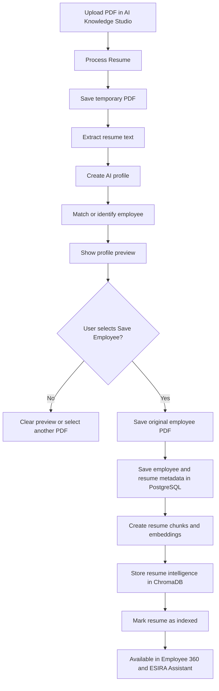

# ESIA — Employee Skill Intelligence Assistant

ESIA helps staffing and HR teams find employees by experience, skills, projects,
training, and certifications extracted from employee resumes.

The application combines:

- **PostgreSQL** for authoritative employee records and resume metadata.
- **ChromaDB** for AI-extracted resume intelligence and semantic search.
- **FastAPI** for backend services.
- **Streamlit** for the end-user interface.
- A configurable AI provider such as **Groq**, **Gemini**, or **Ollama**.

## Main capabilities

- Browse and filter the employee directory.
- Open a combined Employee 360 profile.
- Upload and review a PDF resume before saving it.
- Extract skills, projects, training, certifications, experience, and an AI
  summary from the resume.
- Store resume intelligence in ChromaDB without duplicating skills in
  PostgreSQL master tables.
- Monitor whether each employee resume is indexed.
- Search and compare employees through the ESIRA Assistant.
- Download the saved employee resume.

## How ESIA stores data

| Data | Storage |
|---|---|
| Employee ID, name, email, designation, location, employment status, experience | PostgreSQL |
| Resume filename, file path, upload information, and indexing status | PostgreSQL |
| Original PDF | `documents/resumes/` |
| Skills and primary skill | ChromaDB |
| Projects, training, and certifications | ChromaDB |
| AI summary, resume chunks, and vector embeddings | ChromaDB |

An employee has one active resume file. The saved filename follows this format:

```text
documents/resumes/EMP<employee_id>_<employeeName>.pdf
```

Uploading and saving another resume for the same employee replaces the previous
active resume.

## Resume processing flow



`Process Resume` only creates a reviewable preview. PostgreSQL and ChromaDB are
updated when the user selects `Save Employee`.

## Application pages

### Workforce Overview

Shows employee totals, employment status, resume-index totals, experience
distribution, location distribution, and recent resume activity.

### Employees

Search and filter employees by name, location, designation, and employment
status. Select `View Profile` to open Employee 360.

### Employee 360

Combines the employee record from PostgreSQL with resume intelligence from
ChromaDB. It displays skills, projects, training, certifications, and the AI
summary when the employee resume is indexed.

### AI Knowledge Studio

Upload a PDF resume, process it, review the extracted profile, and select
`Save Employee` to persist and index it.

Upload rules:

- PDF files only.
- Maximum size: 10 MB.
- Review the extracted employee and resume information before saving.
- Do not close or refresh the page while resume processing or saving is active.

### Knowledge Status

Shows which resumes have PostgreSQL metadata and which are indexed in ChromaDB.
Use `Reindex` when a saved resume is present but its index is pending.

### ESIRA Assistant

Ask staffing questions using natural language. Examples:

```text
Find Java developers with React experience.
Show employees with AWS certification.
Find FastAPI developers with Docker and banking experience.
Who has AI experience and is currently available?
```

Matching results can include requirement coverage, role relevance, experience,
semantic similarity, missing requirements, and evidence from the indexed
resume.

## Prerequisites

Before starting ESIA, confirm that the following are available:

- Python 3.11 or 3.12 is recommended.
- PostgreSQL is running and the ESIA database/schema has been provisioned.
- An AI provider is configured:
  - Groq API key, or
  - Google Gemini API key, or
  - A running local Ollama server.
- The application has write access to `documents/`, `chroma_db/`, and `logs/`.

> The repository does not currently provide an automatic database migration
> command. The PostgreSQL employee and resume tables must already exist before
> the application is used.

## Installation

Open PowerShell in the project root:

```powershell
cd "C:\Users\gaugoswa1\Self Learning\GenAI-Practice\ESIA"
```

Create and activate a virtual environment:

```powershell
python -m venv .venv
.\.venv\Scripts\Activate.ps1
```

Install the project dependencies:

```powershell
python -m pip install --upgrade pip
python -m pip install -r requirements.txt
```

## Environment configuration

Create a `.env` file in the project root. Do not commit this file to source
control.

Example configuration using Groq:

```dotenv
APP_NAME=ESIA
APP_VERSION=1.0.0
DEBUG=false

DB_HOST=localhost
DB_PORT=5432
DB_NAME=<database_name>
DB_USER=<database_user>
DB_PASSWORD=<database_password>
DB_SCHEMA=esia

LOG_LEVEL=INFO

LLM_PROVIDER=groq
GROQ_API_KEY=<groq_api_key>
GROQ_MODEL=llama-3.3-70b-versatile

RAG_PROVIDER=langchain
AI_ENGINE=rag

LANGCHAIN_TRACING_V2=false
LANGCHAIN_ENDPOINT=https://api.smith.langchain.com
LANGCHAIN_API_KEY=<optional_langsmith_api_key>
LANGCHAIN_PROJECT=ESIA
```

Use `LLM_PROVIDER=gemini` with `GOOGLE_API_KEY` and `GEMINI_MODEL` to use
Gemini. Use `LLM_PROVIDER=ollama` with `OLLAMA_MODEL` and `OLLAMA_BASE_URL` to
use a local Ollama server.

## Start the application

The backend and UI must run in separate terminals.

### Terminal 1 — Start FastAPI

From the project root:

```powershell
.\.venv\Scripts\Activate.ps1
python -m uvicorn app.main:app --reload --host 127.0.0.1 --port 8000
```

Verify the backend:

- Health check: [http://127.0.0.1:8000/health](http://127.0.0.1:8000/health)
- API documentation: [http://127.0.0.1:8000/docs](http://127.0.0.1:8000/docs)

### Terminal 2 — Start Streamlit

From the project root:

```powershell
.\.venv\Scripts\Activate.ps1
python -m streamlit run ui/app.py --server.port 8501
```

Open [http://localhost:8501](http://localhost:8501).

## Recommended first-time workflow

1. Start PostgreSQL.
2. Start the FastAPI backend.
3. Start the Streamlit UI.
4. Open `Employees` and confirm employee records are visible.
5. Open `AI Knowledge Studio`.
6. Upload a PDF and select `Process Resume`.
7. Review the employee, skills, projects, training, and certifications.
8. Select `Save Employee`.
9. Open `Knowledge Status` and confirm the resume is indexed.
10. Open `Employee 360` to review the combined profile.
11. Search for the employee through `ESIRA Assistant`.

## Troubleshooting

### Unable to connect to the ESIA backend

- Confirm FastAPI is running on `127.0.0.1:8000`.
- Open the `/health` endpoint.
- Confirm no other application is using port 8000.

### PostgreSQL connection error

- Confirm PostgreSQL is running.
- Verify `DB_HOST`, `DB_PORT`, `DB_NAME`, `DB_USER`, and `DB_PASSWORD`.
- Confirm `DB_SCHEMA` exists and the database user has access to it.

### Resume processing returns an AI-provider error

- Confirm `LLM_PROVIDER` matches the configured provider.
- Confirm the corresponding API key and model are valid.
- For Ollama, confirm the Ollama server and selected model are available.

### Employee record appears but resume intelligence is unavailable

- Confirm the resume was saved, not only processed.
- Open `Knowledge Status` and check the ChromaDB status.
- Reindex the employee when the status is pending.
- Confirm the local `chroma_db/` directory is available to the backend.

### Download Resume is unavailable

- Confirm the resume was saved successfully.
- Confirm PostgreSQL contains the resume metadata.
- Confirm the PDF exists under `documents/resumes/`.

### Skills, projects, training, or certifications are blank

- Review the processed profile before saving.
- Confirm the PDF contains extractable text and is not only a scanned image.
- Confirm ChromaDB indexing completed successfully.
- These details are intentionally read from ChromaDB rather than PostgreSQL
  master tables.

## Data and security guidance

- Never commit `.env` or API keys.
- Employee resumes may contain personal information. Restrict access to
  `documents/resumes/`, PostgreSQL, ChromaDB, and application logs.
- Back up PostgreSQL, `documents/resumes/`, and `chroma_db/` together so
  metadata, source documents, and vector intelligence remain consistent.
- Verify important staffing decisions against the original resume and employee
  record. AI match scores are decision-support information, not an automatic
  hiring decision.

## Stopping the application

Press `Ctrl+C` in the Streamlit terminal and the FastAPI terminal. Stop
PostgreSQL or Ollama separately only when they are not required by other
applications.
